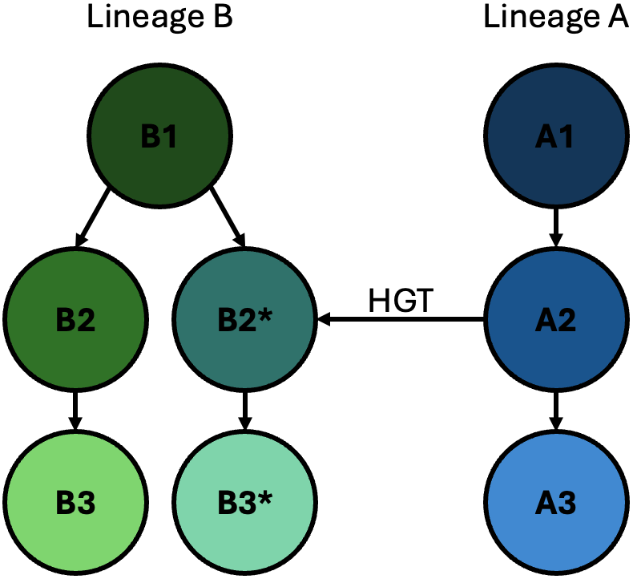

## Master's research
Typically, genes are transferred vertically from parent to offspring organisms. This is known as the vertical inheritence pathway and is common across all of life. Genes can also be transferred via horizontal gene transfer (HGT). Unlike vertical inheritance which only occurs between related individuals, HGT occurs between related or unrelated individuals.

|  | 
|:--:| 
| *A horizontal gene transfer (HGT) event occuring between individuals A2 and B2\* across different lineages.* |

Horizontal gene transfer (HGT) has been typically seen as a mostly prokaryotic phenomenon, despite reports of eukaryotic HGT events being around since the 1990s. I think [Keeling and Palmer (2008)](https://doi.org/10.1038/nrg2386) put forward some good arguments as to why HGT research has been mostly focused on prokatyotic as opposed to eukaryotic organisms.
